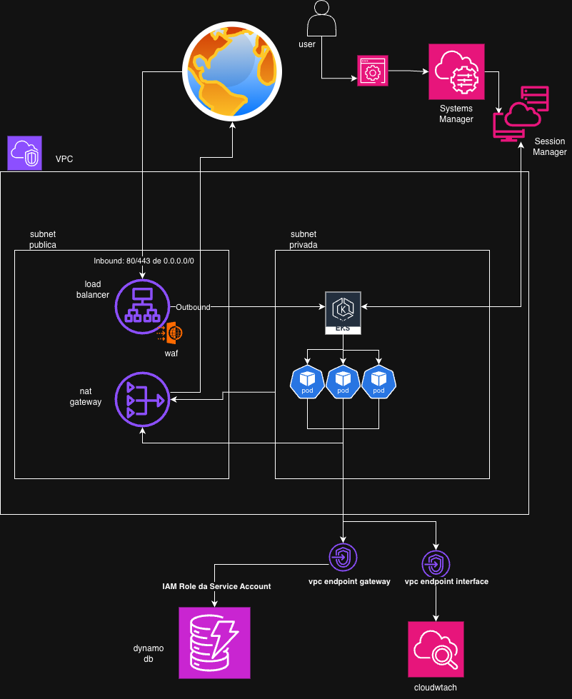

# AWS EKS Lab with Terraform

## Project Overview
This project automates the provisioning of a Kubernetes (EKS) cluster on AWS using Terraform. It is designed as a learning lab to understand Infrastructure as Code (IaC) concepts and AWS networking.

**Context:** This is my first project using Terraform. 

## Architecture


## Infrastructure Implementation

### 1. Advanced Networking & Connectivity (`vpc.tf`)
The network architecture is designed for security and cost efficiency, spanning **two Availability Zones (AZs)** (`us-east-1a`, `us-east-1b`).

* **Private Connectivity (VPC Endpoints):**
    * **DynamoDB (Gateway Endpoint):** Routes traffic internally within the AWS network, avoiding the NAT Gateway to reduce data processing costs and latency.
    * **CloudWatch (Interface Endpoint):** Ensures monitoring data travels securely via private network interfaces (ENI) within the subnets.
* **NAT Strategy:** A single NAT Gateway in `public_1a` provides outbound internet access for private nodes (e.g., for pulling images) without exposing them to inbound connections.

### 2. Compute & Cost Optimization (`eks-node-groups.tf`)
* **Security-First Placement:** Worker nodes are deployed strictly in **Private Subnets**. They have no public IP addresses and are not directly accessible from the internet.
* **Spot Instances:** Utilizes `capacity_type = "SPOT"` (T3 family) to achieve up to 70% cost savings compared to On-Demand instances.
* **Auto Scaling:** Configured to scale seamlessly between 1 and 3 nodes based on cluster load.

### 3. Security & Access Control (`security.tf`, `iam.tf`)
* **Least Privilege Traffic Flow:**
    * **Public ALB:** Accepts HTTP/HTTPS traffic from the internet.
    * **Worker Nodes:** Configured to accept incoming traffic **only** from the Application Load Balancer's Security Group. Direct access is blocked.
* **IRSA (IAM Roles for Service Accounts):**
    * Eliminates the need for hardcoded AWS credentials in the code.
    * Kubernetes Service Accounts are mapped to AWS IAM Roles via **OIDC**. This allows Pods to securely authenticate with **DynamoDB** using temporary, rotated credentials.

## Prerequisites
- Terraform installed.
- AWS CLI installed and configured with appropriate credentials.

## Usage

1. **Navigate to the terraform directory:**
   ```bash
   cd terraform
   ```

2. **Initialize Terraform:**
   Downloads the required providers defined in `versions.tf`.
   ```bash
   terraform init
   ```

3. **Review the Plan:**
   Shows what changes Terraform will make to your infrastructure.
   ```bash
   terraform plan
   ```

4. **Apply the Configuration:**
   Provisions the resources on AWS.
   ```bash
   terraform apply
   ```